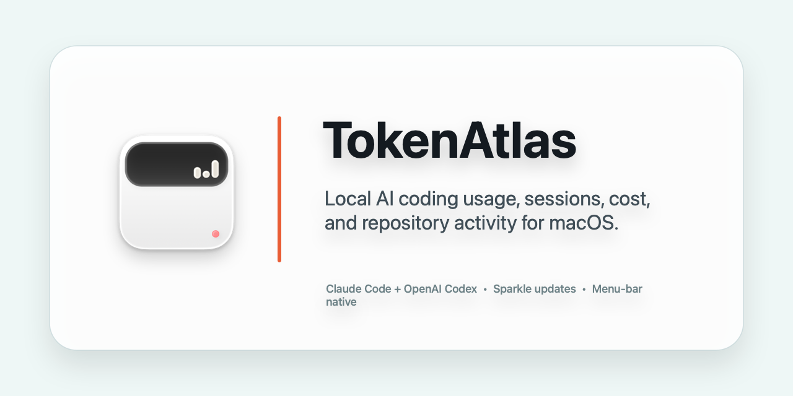
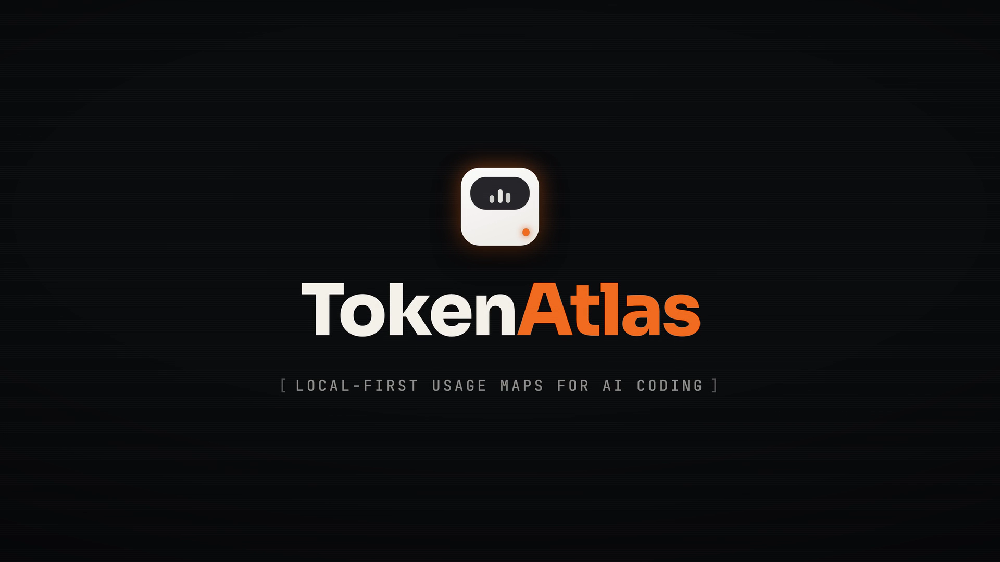
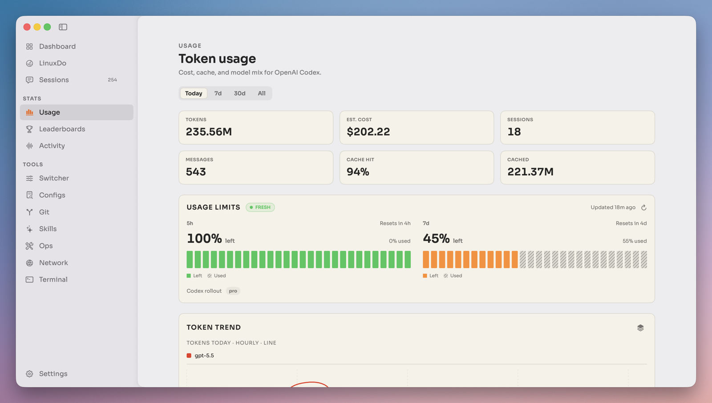
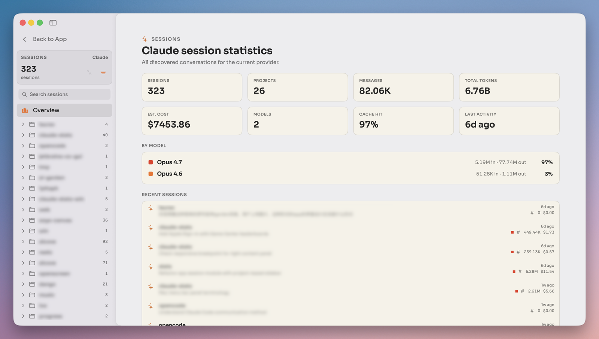
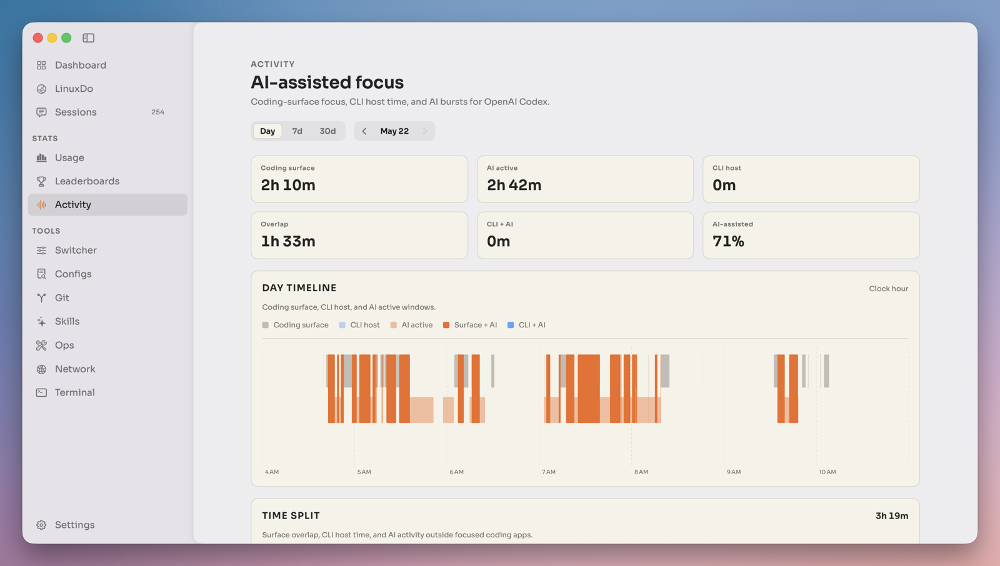
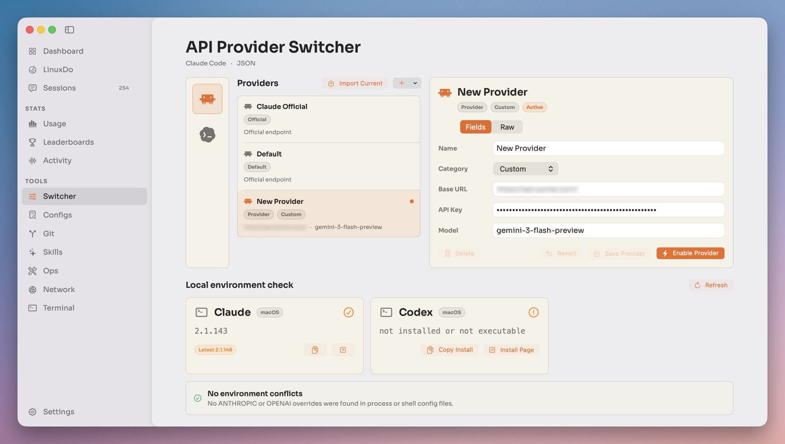
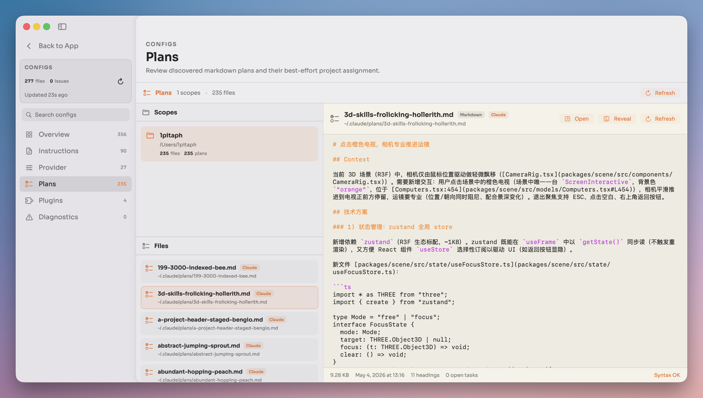
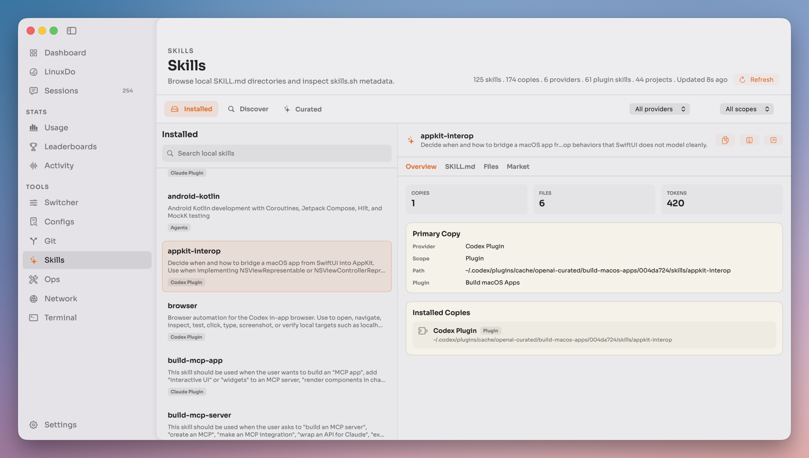

<div align="center">
  
  <h1>TokenAtlas</h1>
  <p><em>📊 Map your local AI coding usage — tokens, cost, sessions, and Git activity — in one native macOS menu-bar app.</em></p>
</div>

<p align="center">
  <a href="https://github.com/can4hou6joeng4/TokenAtlas/stargazers"></a>
  <a href="https://github.com/can4hou6joeng4/TokenAtlas/releases"></a>
  <a href="https://github.com/can4hou6joeng4/TokenAtlas/actions/workflows/release.yml?query=branch%3Amain"></a>
  <a href="LICENSE"></a>
  <a href="https://github.com/can4hou6joeng4/TokenAtlas/commits/main"></a>
  
  
</p>

<p align="center">
  
</p>

> 💡 TokenAtlas reads the traces your AI CLIs **already write to disk** — no API keys, no account, no telemetry. It maps tokens, estimated cost, cache activity, sessions, and Git history for **Claude Code, Codex, and more** into one quiet, native macOS menu-bar app. Your data never leaves your Mac.

## Demo

<div align="center">

<video src="https://github.com/can4hou6joeng4/TokenAtlas/raw/main/docs/assets/tokenatlas-promo.mp4" poster="docs/assets/promo-poster.png" width="900" controls muted playsinline></video>

<p>
  <a href="docs/assets/tokenatlas-promo.mp4">
    
  </a>
</p>

<sub><b>▶ A 60-second tour.</b> GitHub plays the clip inline above; if your client strips it, click the poster to open <a href="docs/assets/tokenatlas-promo.mp4"><code>tokenatlas-promo.mp4</code></a>.</sub>

</div>

## Table of Contents

- [Features](#features)
- [Highlights](#highlights)
- [Quick Start](#quick-start)
- [Privacy](#privacy)
- [Development](#development)
- [Release and Auto-update](#release-and-auto-update)
- [Requirements](#requirements)
- [Project Layout](#project-layout)
- [Design Notes](#design-notes)
- [Open Source](#open-source)
- [Contributors](#contributors)
- [Star History](#star-history)
- [Contributing](#contributing)
- [License](#license)

## Features

- **Menu-bar usage map** — tokens, estimated cost, cache activity, recent sessions, and provider status, **always one click away**.
- **Multi-provider by design** — Claude Code and Codex today, with provider-specific quirks kept **behind a clean adapter protocol** so new CLIs slot in without touching shared code.
- **Sessions and projects** — inspect conversations, projects, messages, model mix, and personal records, **entirely on-device**.
- **Repository activity** — correlate AI coding usage with **local Git history** and bundled language statistics.
- **Optional Notch Island** — Atoll-backed glanceable panels for activity, stats, media, timers, clipboard, and more.
- **Packaged auto-updates** — Sparkle appcast delivery for **manual checks and silent background updates**.

## Highlights

A quiet utility, not a marketing dashboard: restrained color, stable tables, readable numbers, and fast paths to the records that explain a workday.

### Dashboard — your coding activity, day by day

Sessions, messages, total tokens, streaks, and peak hours at a glance, with a token trend you can read in a second.

<p align="center">
  
</p>

### Usage — tokens, cost, cache, and model mix

Cost and cache hit rate per period, broken down by model, for whichever provider you're looking at.

<p align="center">
  
</p>

### Sessions — every conversation, inspectable

Discovered conversations and projects with messages, model mix, and cache hit rate — drill into any single session.

<p align="center">
  
</p>

### Git activity — usage mapped to your commits

Correlate AI coding usage with local Git history and per-language statistics across your repositories.

<p align="center">
  
</p>

<details>
<summary><strong>More views — Activity, Switcher, Configs, Skills</strong></summary>

<br>

<table>
<tr>
  <td align="center" width="50%">
    <br>
    <b>Activity</b><br><sub>Focus timeline of when the work actually happened</sub>
  </td>
  <td align="center" width="50%">
    <br>
    <b>Switcher</b><br><sub>Jump between providers and compare them side by side</sub>
  </td>
</tr>
<tr>
  <td align="center" width="50%">
    <br>
    <b>Configs</b><br><sub>Browse the AI config files each CLI reads</sub>
  </td>
  <td align="center" width="50%">
    <br>
    <b>Skills</b><br><sub>Your skill library, organized and searchable</sub>
  </td>
</tr>
</table>

Animated GIF demos of the menu-bar HUD live in [`docs/assets/screens`](docs/assets/screens).

</details>

## Quick Start

**Install a packaged build**

1. Open the [latest GitHub Release](https://github.com/can4hou6joeng4/TokenAtlas/releases).
2. Download `TokenAtlas-<version>.dmg`.
3. Open the disk image and drag `TokenAtlas.app` to `Applications`.
4. Launch TokenAtlas — it lives in the menu bar.

> Unsigned preview builds may need a right-click ▸ **Open** on first launch. See [Installation and Releases](docs/installation.md) for the zip fallback, the update feed, and the maintainer release flow.

**Build from source**

```bash
git clone --recursive https://github.com/can4hou6joeng4/TokenAtlas.git
cd TokenAtlas
brew install xcodegen
bash scripts/run-debug.sh
```

Already cloned without submodules? Pull them in:

```bash
git submodule update --init --recursive
```

**Run the checks**

```bash
bash scripts/run-tests.sh
```

## Privacy

TokenAtlas is **local-first**. Core usage stats are read from local tool data such as `~/.claude/projects/` and `~/.codex/sessions/`; optional activity and desktop-limit features may request macOS permissions such as Full Disk Access, Accessibility, or Screen Recording.

Network-facing features are opt-in or feature-specific: Sparkle checks for updates, provider status views may query public status pages, and browser-backed integrations may authenticate through the browser. Nothing is sent to a hosted TokenAtlas service — there isn't one.

## Development

`TokenAtlas.xcodeproj` is generated from [`project.yml`](project.yml) with [XcodeGen](https://github.com/yonaskolb/XcodeGen). Use the helper scripts instead of opening stale build products:

```bash
bash scripts/run-debug.sh    # generate, build Debug, and launch
bash scripts/run-tests.sh    # Python + XCTest suites
```

The debug launcher builds into `/tmp/TokenAtlas-build` and launches by full path. This avoids Launch Services conflicts for the menu-bar (`LSUIElement`) app. For local daily use, install a separate bundle:

```bash
bash scripts/install-app.sh
```

## Release and Auto-update

Maintainers cut releases by pushing a semver tag:

```bash
git tag v1.2.0
git push origin v1.2.0
```

The release workflow builds the app, packages a drag-install DMG, creates release notes from source commits, publishes archives to GitHub Releases, and updates the public [Sparkle appcast](https://can4hou6joeng4.github.io/TokenAtlas/appcast.xml) when `SPARKLE_PRIVATE_ED_KEY` is configured. Signing and notarization inputs are documented in [`.github/workflows/release.yml`](.github/workflows/release.yml).

## Requirements

- Apple Silicon Mac with macOS 14+
- Xcode 26.4+ with Swift 6 language mode
- XcodeGen for project generation

## Project Layout

```text
TokenAtlas/       app entry point, providers, services, view models, and SwiftUI views
AtollEmbed/       app-side wrapper for the Atoll / DynamicIsland integration
ThirdParty/       git submodules for embedded upstream projects
TokenAtlasTests/  parser, scanner, settings, integration, and feature tests
docs/assets/      README images, icons, screenshots, and GIFs
scripts/          project generation, local run/test, release, and appcast tooling
```

## Design Notes

Quiet by default, dense when needed. TokenAtlas should feel like a native macOS utility rather than a marketing dashboard: restrained color, stable tables, readable numbers, and fast paths to the records that explain a workday.

Provider-specific behavior lives under `TokenAtlas/Providers/<Provider>/`; shared rendering, formatting, and charts stay in common app layers. Adding a provider should be a provider folder, a `Provider` conformance, and one registry entry — nothing more.

## Open Source

TokenAtlas is released under the [GNU Affero General Public License v3.0](LICENSE). The app also embeds and adapts several major open-source projects:

| Project | License | How TokenAtlas uses it |
| --- | --- | --- |
| [Atoll / DynamicIsland](https://github.com/can4hou6joeng4/Atoll) | GPL-3.0 | Integrated through `AtollEmbed` for the optional Notch Island surface and modules. Its [`NOTICE`](ThirdParty/Atoll/NOTICE) and [`COPYRIGHT_ASSETS`](ThirdParty/Atoll/COPYRIGHT_ASSETS) files remain part of the attribution trail. |
| [OpenComputerUseKit](https://github.com/iFurySt/open-codex-computer-use) | MIT | Vendored under `ThirdParty/OpenComputerUseKit` for internal app automation runtime support. See [`UPSTREAM.md`](ThirdParty/OpenComputerUseKit/UPSTREAM.md) and the preserved [`LICENSE`](ThirdParty/OpenComputerUseKit/LICENSE). |

Additional Swift Package Manager dependencies include Sparkle, Defaults, KeyboardShortcuts, SwiftUIIntrospect, Lottie, MacroVisionKit, SkyLightWindow, AtollExtensionKit, Swift Collections, and SwiftSoup. Those packages keep their upstream licenses and notices.

## Contributors

Thanks to everyone who helps build TokenAtlas. ❤️

<a href="https://github.com/can4hou6joeng4/TokenAtlas/graphs/contributors">
  
</a>

## Star History

<div align="center">
  <a href="https://star-history.com/#can4hou6joeng4/TokenAtlas&Date">
    
  </a>
</div>

If TokenAtlas helps you understand your AI coding work, a ⭐ keeps the project visible and motivates continued development.

## Contributing

Issues, ideas, and pull requests are welcome — start a thread in [Discussions](https://github.com/can4hou6joeng4/TokenAtlas/discussions) or open an [issue](https://github.com/can4hou6joeng4/TokenAtlas/issues). See [CONTRIBUTING.md](CONTRIBUTING.md) and the [Code of Conduct](CODE_OF_CONDUCT.md) first.

Before opening a PR, run the checks:

```bash
bash scripts/run-tests.sh
```

For app behavior changes, also smoke-test the build:

```bash
bash scripts/run-debug.sh
```

## License

TokenAtlas is open source under [AGPL-3.0](LICENSE). A version you modify and run as a network service must stay open under the same license. If you fork TokenAtlas into your own product, please give it a different name and credit TokenAtlas as the source. With gratitude to the maintainers of every embedded project and Swift package catalogued under [Open Source](#open-source), and to everyone who reports issues or sends a pull request.
