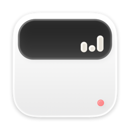

<div align="center">
  
  <h1>TokenAtlas</h1>
  <p><b>A quiet map for local AI coding usage.</b></p>
  <a href="https://github.com/can4hou6joeng4/TokenAtlas/actions/workflows/release.yml?branch=main"></a>
  <a href="https://github.com/can4hou6joeng4/TokenAtlas/releases"></a>
  <a href="LICENSE"></a>
</div>

## Why

AI coding work leaves a lot of local traces: sessions, tokens, costs, repositories, usage limits, provider status, and small pieces of debugging context. Most tools expose those traces as raw logs or isolated panels.

TokenAtlas turns them into a local-first macOS surface: a menu-bar app for quick answers, a native window for deeper inspection, and an optional Notch Island for glanceable state. It began as a focused macOS take on the open-source [Claude Statistics](https://github.com/sj719045032/claude-statistics) project, then grew into a multi-provider foundation for Claude Code, OpenAI Codex, and future AI coding tools.

## See It

<p align="center">
  
</p>

<table>
<tr>
  <td align="center" width="33%">
    
    <br><b>Usage</b>
    <br><sub>Tokens, cost, cache, and model mix by period</sub>
  </td>
  <td align="center" width="33%">
    
    <br><b>Sessions</b>
    <br><sub>Discovered conversations, projects, messages, and cache hit rate</sub>
  </td>
  <td align="center" width="33%">
    
    <br><b>Git Activity</b>
    <br><sub>Commit history correlated with AI coding usage</sub>
  </td>
</tr>
</table>

Additional screenshots and GIF demos live in [`docs/assets/screens`](docs/assets/screens).

## Features

- Menu-bar usage stats for AI coding sessions, tokens, estimated cost, and recent activity.
- Provider support for [Claude Code](https://docs.anthropic.com/en/docs/claude-code) and OpenAI Codex session logs.
- Usage-limit and service-status views for supported providers.
- Local insights, personal records, project rankings, and token trends.
- Git and repository activity views, including optional bundled Git tooling for release builds.
- An Atoll-backed Notch Island surface for optional media, timer, stats, clipboard, and related modules.
- Sparkle-based automatic updates for packaged releases.

## Install

Packaged builds are published through this repository when maintainers cut a
release tag:

- [GitHub Releases](https://github.com/can4hou6joeng4/TokenAtlas/releases)
- [Download and update page](https://can4hou6joeng4.github.io/TokenAtlas/)
- [Sparkle appcast](https://can4hou6joeng4.github.io/TokenAtlas/appcast.xml)

Source, release tags, downloadable app archives, and the Sparkle feed now live
in the same public repository.

Release packaging supports both signed/notarized builds and unsigned fallback builds. If you use an unsigned build, macOS Gatekeeper may require opening it with right-click, then **Open**.

See [Installation and Releases](docs/installation.md) for current release
status, update-feed details, and maintainer release steps.

## Privacy

TokenAtlas is local-first. Core usage stats are read from local tool data such as `~/.claude/projects/` and `~/.codex/sessions/`; optional activity and desktop-limit features may request macOS permissions such as Full Disk Access, Accessibility, or Screen Recording.

Network-facing features are opt-in or feature-specific: Sparkle checks for updates, provider status views may query public status pages, and browser-backed integrations may authenticate through the browser.

## Build

Clone with submodules:

```bash
git clone --recursive https://github.com/can4hou6joeng4/TokenAtlas.git
cd TokenAtlas
```

If you already cloned without `--recursive`, initialize the submodules before
building:

```bash
git submodule update --init --recursive
```

Install local build tools:

```bash
brew install xcodegen
```

For normal development, use the helper scripts:

```bash
bash scripts/run-debug.sh
bash scripts/run-tests.sh
```

`TokenAtlas.xcodeproj` is generated from [`project.yml`](project.yml) with [XcodeGen](https://github.com/yonaskolb/XcodeGen). The debug launcher builds into the canonical `/tmp/TokenAtlas-build` DerivedData path and launches the app by full path; this avoids Launch Services conflicts with menu-bar (`LSUIElement`) builds that share the same bundle identifier.

For a local daily-use install, build and copy the app into Applications:

```bash
bash scripts/install-app.sh
```

This installs `/Applications/TokenAtlas.app` by default and launches that installed bundle. Keep using `scripts/run-debug.sh` for development verification; the `/tmp` debug path and the `/Applications` install path intentionally serve different workflows.

## Release and Auto-update

Maintainers cut releases by pushing a semver tag:

```bash
git tag v1.2.0
git push origin v1.2.0
```

The release workflow builds the app, creates release notes from source commits,
publishes archives to this repository's GitHub Releases, and updates the public
Sparkle appcast when the Sparkle signing key secret is configured.
The required GitHub Actions secrets and notarization inputs are documented in
[`.github/workflows/release.yml`](.github/workflows/release.yml).

## Requirements

- Apple Silicon Mac with macOS 14+
- Xcode 26.4+ with Swift 6 language mode
- XcodeGen for project generation

## Layout

```text
TokenAtlas/      app entry point, providers, services, view models, and SwiftUI views
AtollEmbed/        app-side wrapper for the Atoll / DynamicIsland integration
ThirdParty/        git submodules for embedded upstream projects
TokenAtlasTests/ parser, scanner, settings, integration, and feature tests
docs/assets/       README images, icons, screenshots, and GIFs
scripts/           project generation, local run/test, release, and appcast tooling
```

## Design

Quiet by default, dense when needed. TokenAtlas should feel like a native macOS utility rather than a marketing dashboard: restrained color, stable tables, readable numbers, and fast paths to the records that explain a workday.

Provider-specific behavior lives under `TokenAtlas/Providers/<Provider>/`; shared rendering, formatting, and charts stay in common app layers. Adding a provider should be a provider folder, a `Provider` conformance, and one registry entry.

## Open Source

TokenAtlas is released under the [GNU Affero General Public License v3.0](LICENSE). The app also embeds and adapts several major open-source projects:

| Project | License | How TokenAtlas uses it |
| --- | --- | --- |
| [Atoll / DynamicIsland](https://github.com/can4hou6joeng4/Atoll) | GPL-3.0 | Integrated through `AtollEmbed` for the optional Notch Island surface and modules. Its [`NOTICE`](ThirdParty/Atoll/NOTICE) and [`COPYRIGHT_ASSETS`](ThirdParty/Atoll/COPYRIGHT_ASSETS) files remain part of the attribution trail. |
| [OpenComputerUseKit](https://github.com/iFurySt/open-codex-computer-use) | MIT | Vendored under `ThirdParty/OpenComputerUseKit` for internal app automation runtime support. See [`UPSTREAM.md`](ThirdParty/OpenComputerUseKit/UPSTREAM.md) and the preserved [`LICENSE`](ThirdParty/OpenComputerUseKit/LICENSE). |

Additional Swift Package Manager dependencies include Sparkle, Defaults, KeyboardShortcuts, SwiftUIIntrospect, Lottie, MacroVisionKit, SkyLightWindow, AtollExtensionKit, Swift Collections, and SwiftSoup. Those packages keep their upstream licenses and notices.

## Contributing

Issues and pull requests are welcome. Before opening a PR, run:

```bash
bash scripts/run-tests.sh
```

For app behavior changes, also run:

```bash
bash scripts/run-debug.sh
```
